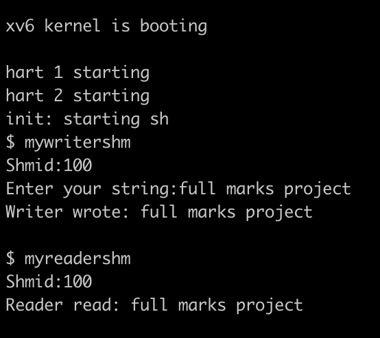
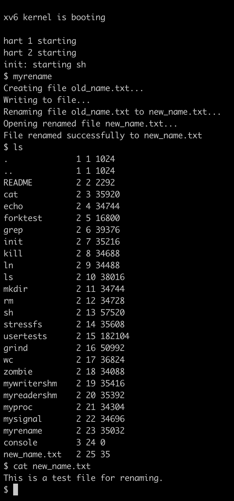
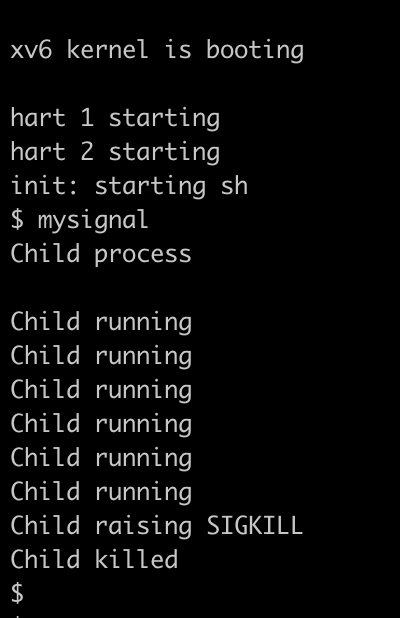
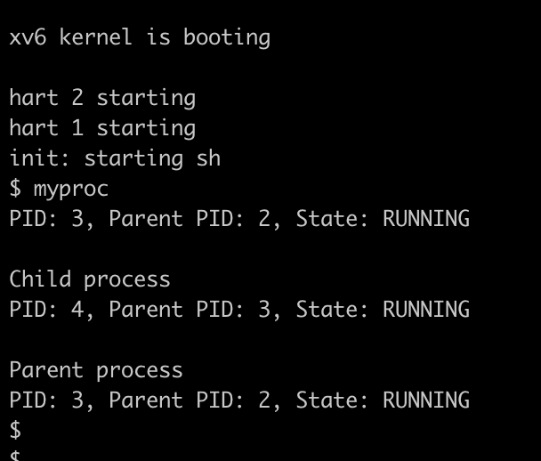

# Operating Systems Course Project

## Table of Contents
1. [Introduction](#1-introduction)
2. [Getting Started](#2-getting-started)
3. [Implementing xv6 System Calls](#3-implementing-xv6-system-calls)

    - [Shared Memory](#i-shared-memory)

   - [Rename File](#ii-rename-file)
   - [Raise Signal](#iii-raise-signal)
   - [Get Process Information](#iv-get-process-information)
4. [Developing a Multiple Client Web Server](#4-developing-a-multiple-client-web-server)
    - [Folders and their purpose](#folders-and-their-purpose)

    - [Functionalities](#functionalities)
5. [Contributors](#5-contributors)

## 1. Introduction

Operating systems form the backbone of modern computing systems, enabling seamless interaction between hardware and software. This project explores two key aspects of operating systems: customizing the lightweight educational operating system xv6 by implementing system calls, and building a robust multi-threaded web server capable of handling multiple clients concurrently.

### Goals:
1. **Extend xv6 functionality** : By implementing and demonstrating custom system calls, we deepen our understanding of kernel development and inter-process communication.
2. **Develop a feature-rich web server** : The web server showcases practical knowledge of multi-threading, synchornisation, HTTP protocol handling, and server management.

## 2. Getting Started

Prerequisites
- Unix-based operating system (for running xv6 and the server)
- ` gcc ` , ` make ` and ` qemu ` (for compilation)
- ` git ` (to clone the repository)

Clone the the repository
```bash
$ git clone https://github.com/jyolx/OS_Project
```

## 3. Implementing xv6 System Calls

We enhanced the xv6-riscv operating system by adding new system calls, each tailored to address specific use cases. Our modifications involved editing both kernel and user-space code. 

To implement our system calls, we wrote their core functionalities in the kernel space, specifically in `sysproc.c` and `sysfile.c`. Each system call was assigned a unique integer identifier in `syscall.h`. This identifier, along with the function definition, was mapped in the system call table within `syscall.c`, enabling the kernel to recognize and route the calls. To make these system calls accessible in user space, we defined their prototypes in `user.h`. The `usys.pl` script was then used to generate user-space stubs that act as entry points for the system calls. Finally, we created user programs to test our system calls and added their object files to the `Makefile`, ensuring they were compiled and linked during the build process.

Each system call has its wrapper function in the user space which you can run once the xv6 system is booted.

To run the xv6 system calls,

Navigate to the xv6-riscv directory and run the following commands
```bash 
$ cd Project1_xv6CustomizeSystemCalls/xv6-riscv
$ make clean
$ make qemu 
```
To exit enter  ```Ctrl+A X```

### You can find the following system calls:

### i. Shared Memory
- `shmget()`

  - creates the shared memory and returns the shared memory ID (shmid) of the shared memory created
- `shmat()`
  - attaches the shared memory space created with the address space of the process 
- `shmdt()`
  - detaches the shared memory
- `shmctl()`
  - destroys the shared memory

Wrapper function for writing into shared memory is
```bash
$ mywritershm
```
Once you enter a string to write into the shared memory run the wrapper function for reading into shared memory
```bash
$ myreadershm
```



### ii. Rename File
- `rename()`

  - renames the given file to the name you want to change it to
  - rename(oldname,newname)

Wrapper function for renaming file
```bash
$ myrename
```



### iii. Raise signal
- `raise()`

  - implemented `raise(SIGKILL)` which terminates the current process where it has been raised

Wrapper function for raising signal
```bash
$ mysignal
```



### iv. Get process information
- `getprocinfo()`

    - gives information about the current process pid, its parent pid and state of the process

Wrapper function for getting information about the current process
```bash
$ myproc
```



## 4. Developing a multiple client web server

We developed a multi-threaded web server capable of handling up to 10 client requests concurrently, leveraging a thread pool architecture to manage the load. The server utilizes a producer-consumer model, where client requests act as the producers and the threads in the pool serve as consumers. The server supports essential HTTP methods to handle a wide variety of client interactions. Each request is logged, capturing relevant details of the server's activity and storing them in a log file for monitoring and debugging purposes. Authentication mechanisms are integrated for restricted resources, ensuring secure access control. Additionally, the server is equipped with robust error handling capabilities, managing various HTTP errors and providing appropriate responses to clients, contributing to a reliable and secure web service.

## Folders and their purpose

### i. Client
- Contains sample client python code to simulate client requests.

### ii. Server

- ### config
  - `server.config` : defines the paramaters of port, network, max thread and document root of the server

  - `users.txt` : keeps track of all users and with their passwords 

- ### data
  - Contains server data requested by the client.

  - Data can be an image, text, audio or html files.
  - Some data are under the `secure` folder which means the client needs to be authenticated to access them.

- ### include
  - Contains the header files to be included to carry out the necessary functionalities

    - `authentication.h`

    - `config.h`
    - `http.h`
    - `logger.h`
    - `server.h`

- ### logs
  - Stores all the logs throughout the server in a `server.log` file

- ### src
  - Contains the files for carrying out all the functionalities

    - `authentication.c` : Decryptes the base64 encoded username and password of the client and checks for a match in `config/users.txt`.

    - `config.c` : Loads the `server.conf` onto a data structure.

    - `http.c` : 
      - Contains functions which handle the HTTP request methods like `GET`, `POST`, `PUT` and `DELETE`.

      - It also checks if the client is authorised if it requests data in the `data/secure` folder. 
      - It also sends back the appropriate HTTP response.

    - `logger.c` : A basic implememtation of a logger to log the server actions on to `logs/server.log`.

    - `server.c` : Using TCP it offers a connection with the clients, implements multithreading to handle multiple client requests and uses semaphores for synchronisation.

    - `main.c` : Root of the server.


### Functionalities

- Serves Static Files
- Supports different HTTP Methods like `GET`, `POST`, `PUT` and `DELETE`
- Logging Requests
- Handles Multiple Content Types
- Error Handling
- Thread Pooling
- Configuration File
- Basic Authentication

## 5. Contributors
<a href="https://github.com/jyolx/OS_Project/graphs/contributors">
  
</a>
